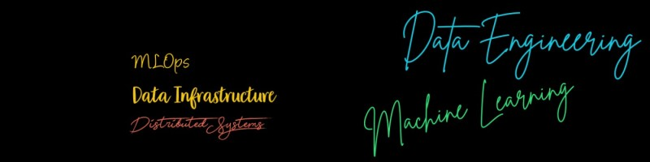

# A very Long never ending Learning around Data Engineering & Machine Learning

## Interesting Reads

* [How to choose a Distributed Database](https://github.com/abhishek-ch/around-dataengineering/blob/master/docs/how_to_choose_db.md)
* [Cockroach DB Architecture](https://www.linkedin.com/posts/iamabhishekchoudhary_cockroachdbarchitecture-activity-6834117247510855680-VeCF)
* [Amundsen Review](https://github.com/abhishek-ch/around-dataengineering/blob/master/docs/amundsen_review.md)
* [Deep Dive - Foundation DB](https://github.com/abhishek-ch/around-dataengineering/blob/master/docs/foundationdb.md)
* [The What, Why, and When of Single-Table Design with DynamoDB](https://www.alexdebrie.com/posts/dynamodb-single-table/)
* [How To Manage And Monitor Apache Spark On Kubernetes](https://www.lightbend.com/blog/how-to-manage-monitor-spark-on-kubernetes-deep-dive-kubernetes-operator-for-spark)
* [Git is hard: screwing up is easy, and figuring out how to fix your mistakes is fucking impossible](https://ohshitgit.com/)
* [8 Practical Use Cases of Change Data Capture](https://medium.com/event-driven-utopia/8-practical-use-cases-of-change-data-capture-8f059da4c3b7)
* [Apache Iceberg- Links](https://github.com/abhishek-ch/around-dataengineering/blob/master/docs/apache_iceberg_read.md)
* [Kubernetes Port Forwarding Manager](https://www.linkedin.com/posts/iamabhishekchoudhary_kubernetes-kuberforwarder-dataengineering-activity-6821345311655555072-aEqx)
* [Querying Parquet with Precision using DuckDB - Much faster compared to Pandas](https://www.linkedin.com/posts/iamabhishekchoudhary_querying-parquet-with-precision-using-duckdb-activity-6821024627578466304-TgRS)
* [What is Apache Pinot - Usecases & Architecture](https://www.linkedin.com/posts/iamabhishekchoudhary_building-latency-sensitive-user-facing-analytics-activity-6818810335286370304-gZAQ)
* [Change Data Streaming Patterns in Distributedsystems](https://www.linkedin.com/posts/iamabhishekchoudhary_cdcpatterns-activity-6828573352563654656-CDS1)
* [Cuckoo Hashing - An alternative to chaining and linear probing for collision handling ](https://www.linkedin.com/posts/iamabhishekchoudhary_cuckoo-hashing-activity-6832911622126784512-3rZB)
* [Riak Database](https://github.com/abhishek-ch/around-dataengineering/blob/master/docs/riakdb.md)
* [Database Indexing](https://www.linkedin.com/posts/iamabhishekchoudhary_databaseindexes-activity-6844509295476924416-Jzto)
* [Parallel Databases using Map Reduce](https://www.linkedin.com/posts/iamabhishekchoudhary_parallel-databases-using-map-reduce-activity-6858620336083136512-NtTz)
* [REST vs GraphQL](https://www.linkedin.com/posts/iamabhishekchoudhary_restapi-vs-graphql-activity-6879712973284364288-O8ad)
* [Linux Namespace & Control Group(cgroup)](https://www.linkedin.com/posts/iamabhishekchoudhary_namespaces-and-cgroups-the-basis-of-linux-activity-6897116562046672897-B5va)
* [SQL Lexical Structure](https://www.linkedin.com/posts/iamabhishekchoudhary_database-golang-dataengineering-activity-6911963969658220544-LCxB)
* [Everything about the Linux kernel](https://www.linkedin.com/posts/iamabhishekchoudhary_github-0xaxlinux-insides-a-little-bit-activity-6932325041955061760-QlwG?utm_source=linkedin_share&utm_medium=member_desktop_web)

## Weekly Digest

* [How #dataengineering get complicated over time](https://www.linkedin.com/posts/iamabhishekchoudhary_dataengineering-realtime-streamprocessing-activity-6808383006567383040-xY-g)
* [What is eBPF - Sandboxing Programs inside #linux Kernel](https://www.linkedin.com/posts/iamabhishekchoudhary_facebook-google-isovalent-microsoft-and-activity-6831817260462608384-p6QN0)
* [Absolute Basic Explanation of SSTable & Log Structured Merge Trees - Sorted String Table & Faster Random Writes](https://www.linkedin.com/posts/iamabhishekchoudhary_datastructures-cassandra-dataengineering-activity-6833629108484784128-u-bN)

## The Data Engineering

#### Level 0
* [Getting started with #dataengineering Volume 6 🎉](https://www.linkedin.com/posts/iamabhishekchoudhary_dataengineering-datapipelines-dag-activity-6770259833363980288-7biE)
* [Getting started with Dataengineering Volume 5 🎉](https://www.linkedin.com/posts/iamabhishekchoudhary_dataengineering-infrastructure-docker-activity-6763429524764975104-lVvy)
* [Getting started with Data Engineering, volume 4 🎉💡](sketchnotes/Getting_started_with_de_vol4.PNG)
* [Getting started with Data Engineering, volume 3 🎉💡](sketchnotes/Getting_started_with_de_vol3.png)
* [Getting started with Data Engineering, volume 2 🎉💡](sketchnotes/Getting_started_with_de_vol2.png)
* [Getting started with Data Engineering, volume 1 🎉💡](sketchnotes/gettingstart_dataengg.png)
* [Getting started with #dataengineering from basics](https://www.linkedin.com/posts/iamabhishekchoudhary_dataengineering-mapreduce-docker-activity-6803350978432180224-GnWW)
* [Apache Airflow 2.0](sketchnotes/Airflow_2_0.jpg)
* [Some Interesting essentials while learning Apache Airflow](sketchnotes/airflow_checklist.png)
* [Dagster Release 0.10.0 - Everything about Exactly-once, Fault-Tolerant Scheduling - Extremely Important Release 🎉🎉🎉](https://www.linkedin.com/posts/iamabhishekchoudhary_dagster-machinelearning-kubernetes-activity-6757931107041255424-KAG1)
* [#getdbt or Data Build Tools interface across all major Data Workflow Management Platform 💯✨🔥](https://www.linkedin.com/posts/iamabhishekchoudhary_getdbt-apacheairflow-dagster-activity-6750389785275240448-N8t_)
* [Apache Superset - An #opensource Fully Featured Business Intelligence Application 🎊🎊🎊](https://www.linkedin.com/posts/iamabhishekchoudhary_apache-superset-10-is-out-activity-6759044550578229248-rerO)
* [The Hop Orchestration Platform, or Apache #Hop (Incubating), aims to facilitate all aspects of data and metadata orchestration 💯💡⭐](https://www.linkedin.com/posts/iamabhishekchoudhary_hop-apachespark-apacheflink-activity-6761641585437396993-ydHg)
* [Apache Iceberg Partitioning is way better than Hive ! Hidden Partitioning makes everything easier! 🎉](https://www.linkedin.com/posts/iamabhishekchoudhary_apacheiceberg-dataengineering-bigdata-activity-6764569890650238976-0skJ)
* [Trino aka #prestosql is different from Apache Spark SQL - Exclusively designed for Distributed SQL 🎉](https://www.linkedin.com/posts/iamabhishekchoudhary_prestosql-bigdata-apachespark-activity-6764906382325010432-qg00)
* [Apache Spark is NOT a Map 
but an MPP/MPI Engine](https://www.linkedin.com/posts/iamabhishekchoudhary_apachespark-mapreduce-dataengineering-activity-6765550560524476416-2c7f)
* [Apache Hudi - Design Principles](https://www.linkedin.com/posts/iamabhishekchoudhary_apachehudi-hadoop-streamprocessing-activity-6767445258792947712-m9c2)
* [OpenTelemetry specification V1.0](https://www.linkedin.com/posts/iamabhishekchoudhary_opentelemetry-specification-v100-tracing-activity-6767783538310873089-N9q5)
* [Everything Around PySpark Pandas UDF 📖](https://www.linkedin.com/posts/iamabhishekchoudhary_revisitingpandasudf-activity-6775378803897221120-rS3z)
* [Important skill-set of a Dataengineer - Reduce Cost](https://www.linkedin.com/posts/iamabhishekchoudhary_dataengineer-cloud-dataengineering-activity-6783023471485091840-2QfG)
* [Everything on PyFlink - Python with Apache Flink](https://www.linkedin.com/posts/iamabhishekchoudhary_apacheflink-dataengineering-python-activity-6785834728302948353-0I0R)
* [Delta Lake Cheat Sheet](https://www.linkedin.com/posts/iamabhishekchoudhary_deltalakecheatsheet-activity-6787337208899678208-LSG3)
* [Dataengineering schedule breakdown, a very flexible estimate](https://www.linkedin.com/posts/iamabhishekchoudhary_dataengineering-distributedsystems-mlops-activity-6791336683653648384-RY3_)
* [Parquet - Introduction & Design, An OpenSource File Format](https://www.linkedin.com/posts/iamabhishekchoudhary_apacheparquet-protocolbuffers-dataengineering-activity-6823244946166857729-0CZf)
* [SQL - Avoiding Antipatterns](https://www.linkedin.com/posts/iamabhishekchoudhary_sqlantipattern-activity-6826491257410396160-xX5P)
* [Explaining Apache Kafka - In children's book format](https://www.linkedin.com/posts/iamabhishekchoudhary_apachekafka-streamprocessing-dataengineering-activity-6811538408763121664-5qpL)
* [The Perfect #dataengineering: Top INVALID Reasons behind #datapipelines failures](https://www.linkedin.com/posts/iamabhishekchoudhary_dataengineering-datapipelines-data-activity-6839946812015603712-FnZq)
* [What is ETL](https://www.linkedin.com/posts/iamabhishekchoudhary_etl-introduction-ugcPost-6864433492600635392-sbBl)
* [What is Proxy & Reverse Proxy](https://www.linkedin.com/posts/iamabhishekchoudhary_dataengineering-activity-6907655591100354560-5DDk)

#### Level 1

* [DataEngg Skills to work with DataScience](sketchnotes/DE_skills_work_with_DS.jpg)
* [Data Quality, A necessity for Data Driven Projects](sketchnotes/arond_dq.png)
* [Essential Cloud Skills for Data Engineering](https://www.linkedin.com/posts/iamabhishekchoudhary_dataengineering-machinelearnig-aws-activity-6758329553036345346-b-40)
* [Open Source Technologies in Data Engineering](sketchnotes/DE_OS.jpg)
* [Kubernetes Fundamentals Required as a Data Engineer](sketchnotes/kubernetes_fundamentals.png)
* [Apache Superset, OSS Business Intelligence for 2021](https://www.linkedin.com/posts/iamabhishekchoudhary_apache-superset-10-is-out-activity-6759044550578229248-rerO)
* [#apachekafka as a Database - Summary on both the sides , Arguments, Trade-offs & exceptional 💬 quotes ⏳💡⏳](https://www.linkedin.com/posts/iamabhishekchoudhary_kafka-as-a-database-yes-or-no-a-summary-activity-6757228852923158528-qVBc)
* [Processing Guarantees in #apachekafka 💯🔆🎉 - The best resource](https://www.linkedin.com/posts/iamabhishekchoudhary_processing-guarantees-in-kafka-activity-6756149463359791104-sJcD)
* [Change Data Analysis with Debezium and Apache Pinot 🎉💡🚿](https://www.linkedin.com/posts/iamabhishekchoudhary_apachepinot-debezium-eventsourcing-activity-6754311102718382080-gWL1)
* [Optimizing Apache Kafka Producers & Consumers 🎊📈🎉](https://www.linkedin.com/posts/iamabhishekchoudhary_apachekafka-strimzi-streamprocessing-activity-6753977207800037376-kNWi)
* [Redpanda -A NON-JVM Streaming Platform for mission critical workloads 💡🎉🔆](https://www.linkedin.com/posts/iamabhishekchoudhary_redpanda-activity-6749640173656559616-Ol6C)
* [Apache Hudi - Turn Batch Jobs to Incremental Model | Complete file management on a Data Lake](https://www.linkedin.com/posts/iamabhishekchoudhary_building-a-large-scale-transactional-data-activity-6760855681277980672-kiZF)
* [Apache Iceberg - an open table format for huge analytic datasets](https://www.linkedin.com/posts/iamabhishekchoudhary_apache-iceberg-activity-6760465145954131968-v0tp)
* [Ballista - Distributed computing platform built primarily on Rust and powered by Apache Arrow](https://www.linkedin.com/posts/iamabhishekchoudhary_ballista-a-distributed-compute-platform-activity-6763021778580246528-Zwj8)
* [ZooKeeper, a distributed, open-source coordination service for distributed applications](https://www.linkedin.com/posts/iamabhishekchoudhary_zookeeperpaper-activity-6764214157366620160-84rM)
* [Apache Iceberg - Partition Evolution, its simple but its so amazing](https://www.linkedin.com/posts/iamabhishekchoudhary_apacheiceberg-dataengineering-datascience-activity-6766299661784403968-T_-i)
* [ApacheKafka without ZooKeeper Sneak Peak🔎](https://www.linkedin.com/posts/iamabhishekchoudhary_apachekafka-distributedsystems-zookeeper-activity-6782957154392432640-3s5r)
* [Why Data Discovery is important for Data Engineering](https://www.linkedin.com/posts/iamabhishekchoudhary_dataengineering-bigdata-datagovernance-activity-6797526472681771008-C-XM)
* [Queue vs Log - Event driven Architecture](https://www.linkedin.com/posts/iamabhishekchoudhary_eventsourcing-distributedsystems-bigdata-activity-6798554566800523264-xa88)
* [Database Indexing](https://www.linkedin.com/posts/iamabhishekchoudhary_postgres-indexes-for-newbies-activity-6889845127477563392-04Kp)

#### Level 1.1
* [Multiple criteria search at scale with Apache Pinot & Theta Sketches](https://www.linkedin.com/posts/iamabhishekchoudhary_solving-for-the-cardinality-of-set-intersection-activity-6789846326893969408-4exe)
* [VM vs Containers - Similar but Different](https://www.linkedin.com/posts/iamabhishekchoudhary_docker-dataengineering-bigdata-activity-6790586642504724480-Zq0e)
* [State of Trino aka PrestoSQL](https://www.linkedin.com/posts/iamabhishekchoudhary_trino-aka-prestosql-state-activity-6790920739471069184-Ipcq)
* [ETL is an extremely important component for any modern business](https://www.linkedin.com/posts/iamabhishekchoudhary_dataengineering-datawarehouse-bigdata-activity-6789114504010625024-V-lz)
* [Top 5 ways to complicate a #dataengineering pipeline/application 💥](https://www.linkedin.com/posts/iamabhishekchoudhary_dataengineering-functionalprogramming-bigdata-activity-6802551801179631616-u6a0)
* [Leader election is commonly used aka Master/Namenode/Leader/Driver](https://www.linkedin.com/posts/iamabhishekchoudhary_leaderelection-activity-6802979035270938624-VYYF)
* [Dagster vs Airflow - A comparison](https://www.linkedin.com/posts/iamabhishekchoudhary_moving-past-airflow-why-dagster-is-the-next-generation-activity-6800808471768969216-__wj)
* [About Single Source of Truth in DataEngineering](https://www.linkedin.com/posts/iamabhishekchoudhary_dataengineering-machinelearning-dataanalytics-activity-6801541986638733312-81gM)
* [Change Data Capture for Distributed Databases](https://www.linkedin.com/posts/iamabhishekchoudhary_change-data-capture-for-distributed-databases-activity-6821429243944206336-HiJL)
* [Deep Dive on Why Apache Iceberg for Change Data Capture, using Apache Flink 🎉](https://www.linkedin.com/posts/iamabhishekchoudhary_apacheiceberg-deltalake-realtime-activity-6813803694627336192-W7M7)
* [OpenMetadata is an Open Standard for Metadata. A Single place to Discover, Collaborate, and Get your data right](https://www.linkedin.com/posts/iamabhishekchoudhary_metadata-datamesh-amundsen-activity-6833223767699845120-8U5h)
* [About Lakehouse](https://www.linkedin.com/posts/iamabhishekchoudhary_datawarehouse-lakehouse-machinelearning-activity-6839506317648941056-d23r)
* [etcd - A distributed, reliable key-value store for the most critical data of a distributed system](https://www.linkedin.com/posts/iamabhishekchoudhary_etcd-distributed-reliable-key-value-store-activity-6854393688827711488-1mts)
* [What is Redis](https://www.linkedin.com/posts/iamabhishekchoudhary_what-is-redis-data-store-activity-6859358023492648960-YxoZ)
* [What is Hive](https://www.linkedin.com/posts/iamabhishekchoudhary_what-is-apache-hive-activity-6862273737388032000-nRSq)
* [What is Data Warehouse - An Introduction](https://www.linkedin.com/posts/iamabhishekchoudhary_what-is-data-warehouse-activity-6862625346521583616-x6Yl)
* [Fundamentals of Designing Data Warehouse](https://www.linkedin.com/posts/iamabhishekchoudhary_fundamentals-of-designing-data-warehouse-activity-6865875658413793280-3Cln)
* [Database Relational Model - A way of looking at Data](https://www.linkedin.com/posts/iamabhishekchoudhary_database-relational-model-activity-6888768611230511104-Eyu4)
* [Data Engineering Infrastructure Notes](https://www.linkedin.com/posts/iamabhishekchoudhary_data-engineering-infrastructure-notes-activity-6901541636677910528-jjxL)

#### Dataengineering Core 

* [A Data Engineering Story - The Beginning](https://github.com/abhishek-ch/around-dataengineering/blob/master/docs/blog1/index.md)
* [Data Engineering - More towards Data Science or Data Analytics or ...](https://github.com/abhishek-ch/around-dataengineering/tree/blog2) 
* [Data Engineering Interview Patterns](sketchnotes/DE_Interview.jpg)
* [Basic Checklists while learning Apache Spark](sketchnotes/spark_checklist.png)
* [#apachespark for Distributed Analytics or #businessinteligence Platform - Worth or not ?](https://www.linkedin.com/posts/iamabhishekchoudhary_apachespark-businessinteligence-analytics-activity-6754429988021387264-kA7V)
* [Apache Beam for Search: An Introduction & Addressing the challenge of the Time Problem 🔐💡🔒](https://www.linkedin.com/posts/iamabhishekchoudhary_apachebeam-apachekafka-dataengineering-activity-6753591516708573184-1-p6)
* [Nextflow is a Workflow Manager exclusively for #bioinformatics 🩹💊🩹](https://www.linkedin.com/posts/iamabhishekchoudhary_bioinformatics-distributedsystems-kubernetes-activity-6749644503558238209-ufTg)
* [#apachespark Project Zen Update - Making PySpark Better 💡🔗💡](https://www.linkedin.com/posts/iamabhishekchoudhary_project-zen-improving-apache-spark-for-python-activity-6748904711069474816-3iQN)
* [Design - Exactly Once Delivery & Transactional Messaging in #apachekafka 🎊📋🎊](https://www.linkedin.com/posts/iamabhishekchoudhary_exactlyoncekafka-activity-6762359693802299392-Gch3)
* [underrated but important skill of a Data Engineer](https://www.linkedin.com/posts/iamabhishekchoudhary_dataengineer-datascience-dataengineering-activity-6775777891335647232-6573)
* [Fallacies of Distributed Systems](https://www.linkedin.com/posts/iamabhishekchoudhary_dataengineering-distributedsystems-cloud-activity-6776439768591998976-aE6h)
* [As a Data Engineer, some Essentials I did which really helped Data Scientists and the Team](https://www.linkedin.com/posts/iamabhishekchoudhary_dataengineer-datascientists-kubernetes-activity-6779784194651504640-zIUP)
* [A very normal Data Engineering work 🎉](https://www.linkedin.com/posts/iamabhishekchoudhary_dataengineering-python-kubernetes-activity-6772461203500384256-yrAH)
* [What can go wrong in Distributed Data Systems](https://www.linkedin.com/posts/iamabhishekchoudhary_dataengineers-dataengineering-machinelearning-activity-6771387632715935744-wZCk)
* [Architect and build an #machinelearning use case end to end using Amazon SageMaker 🎉](https://www.linkedin.com/posts/iamabhishekchoudhary_architect-and-build-the-full-machine-learning-activity-6775727947325214721-iYAW)
* [Around Data Discovery or Metadata Management Platforms](https://www.linkedin.com/posts/iamabhishekchoudhary_datadiscovery-metadatamanagement-datascientists-activity-6777238261258682368-fkGa)
* [Amazon S3 Object Lambda - Provide Different Views of Data to Multiple Applications](https://www.linkedin.com/posts/iamabhishekchoudhary_introducing-amazon-s3-object-lambda-use-activity-6778582018067378176-fzvy)
* [Full Stack Data Engineer](https://www.linkedin.com/posts/iamabhishekchoudhary_hadoop-apachespark-kubernetes-activity-6781152322971074560-VWvK)
* [Data cleaning is Hard but why](https://www.linkedin.com/posts/iamabhishekchoudhary_whys-it-hard-to-teach-data-cleaning-activity-6782684736637693953-JiLg)
* [Most exciting things about #dataengineering](https://www.linkedin.com/posts/iamabhishekchoudhary_dataengineering-distributedsystems-machinelearning-activity-6783666378680401920-E23H)
* [The real impact of Disks on #rocksdb State Backend in Apache Flink](https://www.linkedin.com/posts/iamabhishekchoudhary_the-impact-of-disks-on-rocksdb-state-backend-activity-6784115938338906112-FTVY)
* [Tips for Distributed System High Availability](https://www.linkedin.com/posts/iamabhishekchoudhary_tips-for-high-availability-activity-6785942817693855744-8KFF)
* [interesting way of collaboration between a Dataengineer & Datascientis](https://www.linkedin.com/posts/iamabhishekchoudhary_dataengineer-datascientist-datascience-activity-6786211019640369152-QrFF)
* [Building DistributedLog: High-performance replicated log service 🎉](https://www.linkedin.com/posts/iamabhishekchoudhary_distributedsystems-dataengineering-bigdata-activity-6786283090441506816-kCob)
* [Whiz: Data Analytics Execution Framework based on Intermediate Data](https://www.linkedin.com/posts/iamabhishekchoudhary_whiz-data-driven-analytics-execution-activity-6788003925300707328-2Yuy)
* [Adding unlimited Nodes in a #dataengineering platform will eventually drop](https://www.linkedin.com/posts/iamabhishekchoudhary_dataengineering-distributedsystems-bigdata-activity-6788418825047080960-iTiv)
* [A typical Data Engineering Pipeline](https://www.linkedin.com/posts/iamabhishekchoudhary_dataengineering-data-bigdata-activity-6800075858917773312-W_Lc)
* ['Log' is a fundamental component of a Data Engineering Ecosystem](https://www.linkedin.com/posts/iamabhishekchoudhary_apacheiceberg-deltalake-dataengineering-activity-6804701361796636672-MOFm)
* [Flink CDC](https://github.com/abhishek-ch/around-dataengineering/blob/master/flink_cdc.md)
* [Readings Around Databases](https://github.com/abhishek-ch/around-dataengineering/blob/master/docs/Reading_ardound_database.md)
* [Code Review Best Practice, bcz Developers, hate code reviews](https://www.linkedin.com/posts/iamabhishekchoudhary_codereviewbestpractice-activity-6812358358906019840-Qfw5)
* [Important Performance Criteria to measure DataEngineering Systems](https://www.linkedin.com/posts/iamabhishekchoudhary_dataengineering-distributedsystems-datastructures-activity-6848612433121157120-wrNi)
* [Database Internals - Storage](https://www.linkedin.com/posts/iamabhishekchoudhary_database-storage-internals-activity-6863372646696972288-Hsia)
* [Data Integration for Databases & Data Warehousing - An Introduction](https://www.linkedin.com/posts/iamabhishekchoudhary_data-integration-introduction-activity-6872779193617309696-HU54)
* [What is Protocol Buffer - An excellent important data interchange format for serialization, "Zero Copy" format](https://www.linkedin.com/posts/iamabhishekchoudhary_protocol-buffer-activity-6886960430330232832-ONrn)
* [Memcached, Redis & Elasticache - To accelerate your data or databases](https://www.linkedin.com/posts/iamabhishekchoudhary_memory-memcached-redis-elasticache-activity-6891708019474788352-8ur_)
* [What is LSM-Tree](https://www.linkedin.com/posts/iamabhishekchoudhary_lsm-tree-activity-6901823852150624256-cnbq)
* [Tor aka Onion Router - How does it work?](https://www.linkedin.com/posts/iamabhishekchoudhary_dataengineering-activity-6909070959350059009-QfFq?utm_source=linkedin_share&utm_medium=member_desktop_web)

#### Infrastructure

* [SQL Database on Kubernetes - Best Practices](https://www.linkedin.com/posts/iamabhishekchoudhary_sql-database-on-kubernetes-considerations-activity-6755432993130643457-Zts2)
* [Devtron - An Open Source DevOps on Kubernetes, written in Go 🥇🎁🎉](https://www.linkedin.com/posts/iamabhishekchoudhary_devtron-multicloud-infrastructure-activity-6749978071970975744-PcPs)
* [Most Popular #opensource BI & Data Analytics Platforms 🎊💡🎉](https://www.linkedin.com/posts/iamabhishekchoudhary_opensource-dataengineering-datascience-activity-6749258103369322496-hc5C)
* [datapipelines Dataframe APi is now available with #apachebeam 💯🔥💯](https://www.linkedin.com/posts/iamabhishekchoudhary_datapipelines-apachebeam-python-activity-6748167921433948160-oWfT)
* [Disaster Recovery for Multi-Region Apache Kafka & Data Consumption using #apacheflink 🔅🎉🔅](https://www.linkedin.com/posts/iamabhishekchoudhary_disaster-recovery-for-multi-region-kafka-activity-6747422409218940928-70Rf)
* [Kubernetes Api Structure 💯✔️💯](https://www.linkedin.com/posts/iamabhishekchoudhary_kubernetes-dataengineering-machinelearning-activity-6759074145817944064-dHIl)
* [Architecting a Kubernetes Infrastructure 💯](https://www.linkedin.com/posts/iamabhishekchoudhary_a-deep-dive-into-architecting-a-kubernetes-activity-6761257898438918144-N74g)
* [Exploring Kubernetes Operator Pattern 💡](https://www.linkedin.com/posts/iamabhishekchoudhary_exploring-kubernetes-operator-pattern-activity-6762000800911814656-Jre7)
* [Docker is an interal part of Data Engineering ML pipeline & that makes security 🔐 extremely essential](https://www.linkedin.com/posts/iamabhishekchoudhary_docker-security-activity-6763766659426660353-_MIa)
* [Rack awareness for #apachekafka Streams Proposal 🎉](https://www.linkedin.com/posts/iamabhishekchoudhary_apachekafka-kafkastreams-dataengineering-activity-6779000842264592384-NA4J)
* [Dolt is Git for Data 🎊](https://www.linkedin.com/posts/iamabhishekchoudhary_sql-bigdata-datascience-activity-6774623291329060864-QKYb)
* [Toward Better Data Culture From First Principles by Ube](https://www.linkedin.com/posts/iamabhishekchoudhary_dataengineering-dataengineer-bigdata-activity-6780824810315403264-e0hC)
* [Fast and Reliable Schema-Agnostic Log Analytics Platform by Uber](https://www.linkedin.com/posts/iamabhishekchoudhary_elasticsearch-elk-dataengineering-activity-6783364868515934208-jhj6)
* [Simple Testing Can Prevent Most Critical Failures: An Analysis of Production Failures in Distributed Data-Intensive Systems📋](https://www.linkedin.com/posts/iamabhishekchoudhary_simple-testing-can-prevent-most-critical-failures-activity-6784411707830779904-ds3_)
* [Diving Deep on S3 Consistency - Insightful](https://www.linkedin.com/posts/iamabhishekchoudhary_diving-deep-on-s3-consistency-activity-6793185152844513280-k48V)
* [Ray- General Purpose ML Infrastructure](https://github.com/abhishek-ch/around-dataengineering/blob/master/docs/ray_distributed_ml.md)
* [Kubernetes Hardening Guide by National Security Agency](https://www.linkedin.com/posts/iamabhishekchoudhary_kubernetes-hardening-guide-activity-6831118268779020288-KQfU)
* [Everything around Load Balancer](https://www.linkedin.com/posts/iamabhishekchoudhary_distributedsystems-datainfrastructure-loadbalancing-activity-6840255837957607424-oOmk)
* [Data Lakehouse - Is it really the end of Datawarehouse](https://www.linkedin.com/posts/iamabhishekchoudhary_datawarehouse-lakehouse-machinelearning-activity-6839506317648941056-d23r)
* [Real-Time Exactly-Once Processing with Apache Flink, Kafka, and Pinot @uber](https://www.linkedin.com/posts/iamabhishekchoudhary_distributedsystems-apacheflink-apachekafka-activity-6850759002620522496-zq8w)
* [WTH is Kubernetes Operator? - An Introduction](https://www.linkedin.com/posts/iamabhishekchoudhary_k8s-operator-introduction-activity-6850331132089679872-_sVt)
* [Lessons Learned from Sharding Postgres](https://www.linkedin.com/posts/iamabhishekchoudhary_herding-elephants-lessons-learned-from-sharding-activity-6856096160822697984-x4es)
* [What is Kubernetes- An introduction](https://www.linkedin.com/posts/iamabhishekchoudhary_kubernetes-introduction-activity-6861168802697220096-wCI1)
* [ELK Stack - Introduction of Scalable Monitoring](https://www.linkedin.com/posts/iamabhishekchoudhary_elk-stack-introduction-activity-6864796949678223360-j-oo)
* [What is NGINX - An Introduction](https://www.linkedin.com/posts/iamabhishekchoudhary_nginx-introduction-activity-6867698654820519937-Z_cX)
* [What is Load Balancer - An Introduction](https://www.linkedin.com/posts/iamabhishekchoudhary_what-is-load-balancer-an-introduction-activity-6866977826793435136-SmCk)
* [What is OAuth 2 - Introduction|API Based Authorization](https://www.linkedin.com/posts/iamabhishekchoudhary_oauth-2-introduction-activity-6877542164289728512-m1WG)
* [Kubernetes & Networks - It's hard because multiple options are available](https://www.linkedin.com/posts/iamabhishekchoudhary_k8s-networks-activity-6880088004594151424-FhbK)
* [Kubernetes Reconciliation](https://www.linkedin.com/posts/iamabhishekchoudhary_k8s-what-is-reconciliation-activity-6881167406342004736-FbuO)
* [Troubleshooting Kubernetes App](https://www.linkedin.com/posts/iamabhishekchoudhary_troubleshooting-kubernetes-app-activity-6885146702148435968-n1oo)
* [Kubernetes Best Practices - Classics](https://www.linkedin.com/posts/iamabhishekchoudhary_kubernetes-best-practices-activity-6886580619527155712--h7D)
* [Paper: Serverless Computing: A Survey of Opportunities, Challenges, and Applications](https://www.linkedin.com/posts/iamabhishekchoudhary_serverless-computing-activity-6890329219063189504-7P-5)
* [Choosing the Kubernetes Local Cluster](https://www.linkedin.com/posts/iamabhishekchoudhary_local-kubernetes-cluster-which-why-activity-6897194508409278464-CV61)
* [Monitoring Kubernetes - Fundamentals of #kubernetes Infrastructure Monitoring](https://www.linkedin.com/posts/iamabhishekchoudhary_kubernetes-monitoring-fundamental-activity-6897830067133571072-hmnv)
* [Kubernetes Controller Manager](https://www.linkedin.com/posts/iamabhishekchoudhary_kubernetes-controller-manager-concept-activity-6900449709870104577-4T0d)
* [Kubernetes: Why the Pod is still in the Pending State?](https://www.linkedin.com/posts/iamabhishekchoudhary_understanding-kubernetes-pod-pending-problems-activity-6931949104704962560-OOOl?utm_source=linkedin_share&utm_medium=member_desktop_web)
* [Kubernetes Liveness & Readiness Probe](https://www.linkedin.com/posts/iamabhishekchoudhary_introduction-to-kubernetes-probes-activity-6936950535275048961-8wYL?utm_source=linkedin_share&utm_medium=member_desktop_web)

## SQL
* [Advanced SQL - Reference CS 564 Database Management Systems](https://www.linkedin.com/posts/iamabhishekchoudhary_advanced-sql-2-activity-6845598540790599680-gTgH)
* [SQL and Advanced SQL - An asset](https://www.linkedin.com/posts/iamabhishekchoudhary_advancedsql-activity-6844892160798584832-gBTl)
* [Database Indexing - Almost Everything](https://www.linkedin.com/posts/iamabhishekchoudhary_databaseindexes-activity-6844509295476924416-Jzto)
* [Tuning SQL queries - Tips for writing efficient & faster Queries](https://www.linkedin.com/posts/iamabhishekchoudhary_query-optimization-techniques-sql-activity-6844123194836742144-aptY)
* [Database Schema Design - Schema Design is a Complicated Necessity](https://www.linkedin.com/posts/iamabhishekchoudhary_database-schema-design-activity-6843509027025022976-qbRF)
* [SQL Query Processing Plan - Basics](https://www.linkedin.com/posts/iamabhishekchoudhary_queryprocessingplan-activity-6843139272497774592-10sT)
* [Revisiting SQL Basics - The beginning of Data Science & Data Engineering](https://www.linkedin.com/posts/iamabhishekchoudhary_basic-sql-activity-6842758586142142464-kJ_U)
* [Distributed Advanced Queries - Presto/Trino](https://www.linkedin.com/posts/iamabhishekchoudhary_advanced-sql-distributed-query-engine-prestotrino-activity-6845952140645593088-r6BJ)
* [SQL Notes For Professionals, 100+ pages](https://www.linkedin.com/posts/iamabhishekchoudhary_sqlnotes4professional-activity-6846303034914471936-q1T9)
* [Table Partitioning](https://www.linkedin.com/posts/iamabhishekchoudhary_database-dataengineering-sql-activity-6846689189979844609-yXQS)
* [SQL complex Queries - Nested Queries & Aggregation](https://www.linkedin.com/posts/iamabhishekchoudhary_nested-queries-and-aggregation-activity-6847059870416474112-tSkY)
* [Gossip Protocols - Designed for Data Consistency & Fault-Tolerance](https://www.linkedin.com/posts/iamabhishekchoudhary_p2p-gossip-protocol-activity-6847021932785786880-A2Oj)
* [Table Partitioning - An Important Concept](https://www.linkedin.com/posts/iamabhishekchoudhary_database-dataengineering-sql-activity-6846689189979844609-yXQS)
* [Database Concurrency Control : 2 Phase Locking](https://www.linkedin.com/posts/iamabhishekchoudhary_sql-database-dataengineering-activity-6847472978335195136-qqaC)
* [Database Entity Relationship Model](https://www.linkedin.com/posts/iamabhishekchoudhary_the-entity-relationship-er-model-activity-6848113792358907904-bwRc)
* [SQL Join Fundamentals](https://www.linkedin.com/posts/iamabhishekchoudhary_sql-joins-activity-6848474520647458816-3ACA)
* [Database Indexing](https://www.linkedin.com/posts/iamabhishekchoudhary_database-performanceandindexes-activity-6848848899260653569-l1gz)
* [Database Indexing Notes](https://www.inf.unibz.it/~artale/DB2/handout2.pdf)
* [SQL Injection Introduction](https://www.linkedin.com/posts/iamabhishekchoudhary_sql-injection-introduction-activity-6849573020533608448-tsWX)
* [SQL Constraints Fundamentals](https://www.linkedin.com/posts/iamabhishekchoudhary_sql-constraints-activity-6849207436176363520-hiDU)
* [The fundamental of writing SQL queries is different from](https://www.linkedin.com/posts/iamabhishekchoudhary_programming-dataengineering-datanalytics-activity-6797939314098520064-hMfd)
* [Building a NoSQL Database using Git](https://www.linkedin.com/posts/iamabhishekchoudhary_gitasnosqldatabase-activity-6820624465861390336-qwpo)
* [Against SQL - An article on What is not good with #sql ](https://www.linkedin.com/posts/iamabhishekchoudhary_sql-database-data-activity-6819964297423179776-OPr5)
* [Using `EXPLAIN` for Data Problems - Things beyond SQL](https://www.linkedin.com/posts/iamabhishekchoudhary_databaseexplain-activity-6819573919389941760-euD5)
* [10 SQL Queries to Blow Your Mind 🎉](https://www.linkedin.com/posts/iamabhishekchoudhary_sqlmightiestqueries-activity-6829031645870374912-HW88)
* [Views, Stored Procedures, Functions & Triggers - SQL ](https://www.linkedin.com/posts/iamabhishekchoudhary_viewstoredproceduretriggersql-activity-6850663245687115776-1V75)
* [SQL Transaction & ACID Property](https://www.linkedin.com/posts/iamabhishekchoudhary_sql-transaction-activity-6851020805803958272-w69d)
* [How to Solve complex SQL queries](https://www.linkedin.com/posts/iamabhishekchoudhary_sqlcomplexqueriesapproach-activity-6851755823228604416-uoVK)
* [Apache Spark SQL - The Introduction from RDMBS till SparkSQL](https://www.linkedin.com/posts/iamabhishekchoudhary_sparksqlintroduction-activity-6852476659761782785-MOLf)
* [Advanced SQL & Functions](https://www.linkedin.com/posts/iamabhishekchoudhary_advanced-sql-functions-activity-6853198639423123456-0g0q)
* [Basic & Intermediate on Database Sharding](https://www.linkedin.com/posts/iamabhishekchoudhary_database-sharding-basic-intermediate-activity-6855026526132477952-UGya)
* [Complex Database Queries with PostgreSQL](https://www.linkedin.com/posts/iamabhishekchoudhary_complex-database-queries-activity-6854642670451650560-P7xv)
* [Query Evaluation - Technical Details "when you execute SQL Query"](https://www.linkedin.com/posts/iamabhishekchoudhary_queryevaluation-activity-6853910123237183488-kdw7)
* [What is Materialized View & how does work in Distributed Databases](https://www.linkedin.com/posts/iamabhishekchoudhary_materialized-view-activity-6853558113245773824-6gBQ)
* [Breaking Down NoSQL Sharding, Replication & Consistency](https://www.linkedin.com/posts/iamabhishekchoudhary_whynosqlshardingiscomplicated-activity-6855744363792781312-KxQz)
* [Database Query Optimization Technique](https://www.linkedin.com/posts/iamabhishekchoudhary_queryoptimizationtechniques-activity-6856460121778790400-PWrb)
* [Intermediate SQL](https://www.linkedin.com/posts/iamabhishekchoudhary_intermediate-sql-activity-6856827085349040128-IxvM)
* [SQL Stored Procedures](https://www.linkedin.com/posts/iamabhishekchoudhary_sqlproceduresdeep-dive-activity-6859022836573507584-3Khi)
* [OLAP & OLTP - Datawarehouse Data Mining](https://www.linkedin.com/posts/iamabhishekchoudhary_olap-vs-oltp-activity-6860811031833296896-fapF)
* [Database Fundamentals](https://www.linkedin.com/posts/iamabhishekchoudhary_database-fundamentals-activity-6863695598084775936-ZgKM)
* [SQL Subqueries](https://www.linkedin.com/posts/iamabhishekchoudhary_sql-subqueries-activity-6868420033782059008-wfr8)
* [NewSQL Introduction - Basic to Intermediate](https://www.linkedin.com/posts/iamabhishekchoudhary_newsql-introduction-activity-6867339297767387136-O-sG)
* [SQL Intermediate & basics Deep Dive](https://www.linkedin.com/posts/iamabhishekchoudhary_introduction-to-sql-intermediate-deep-dive-activity-6869861428271091712-Pbmm)
* [SQL Basics - The Starting point](https://www.linkedin.com/posts/iamabhishekchoudhary_sql-basics-ugcPost-6869502880605360128-78iw)
* [Data Warehousing & OLAP Technology](https://www.linkedin.com/posts/iamabhishekchoudhary_dwholap-activity-6871337092929138689-QMcd)
* [Snowflake Datawarehouse](https://www.linkedin.com/posts/iamabhishekchoudhary_snowflake-activity-6871720966620282880-23OI)
* [RelationalAlgebra & SQL](https://www.linkedin.com/posts/iamabhishekchoudhary_relationalalgebrasql-activity-6874631115001393152-nMFW)
* [Logical Schema Design: SQL Database](https://www.linkedin.com/posts/iamabhishekchoudhary_logical-schema-design-sql-activity-6876437920027439104-uncn)
* [Kubernetes Pod Internals - Deep Dive](https://www.linkedin.com/posts/iamabhishekchoudhary_kubernetes-pod-internals-activity-6878625725881171968-MfQn)
* [The Illustrated Children's Guide to Kubernetes](https://www.linkedin.com/posts/iamabhishekchoudhary_kubernetes-children-book-activity-6884036918624034816-DtTK)
* [SQL Subqueries by Example](https://www.linkedin.com/posts/iamabhishekchoudhary_understanding-subqueries-by-examples-activity-6890591994150760448-mdsN)
* [What is Write-Ahead-Logging (WAL)](https://www.linkedin.com/posts/iamabhishekchoudhary_wal-write-ahead-log-activity-6894184345448321024-dW5p)
* [SQL Transactions](SQL Transactions - a sequence of database operations)
* [Linux Productivity Tools - This is a Data Infrastructure necessity](https://www.linkedin.com/posts/iamabhishekchoudhary_linux-productivity-activity-6905439443684007937-A5PF)

### NoSQL
* [NoSQL & MongoDB]https://www.linkedin.com/posts/iamabhishekchoudhary_nosql-mongodb-activity-6874231633654935553-Z66u)
* [CouchDB Introduction - • Document Storage Database](https://www.linkedin.com/posts/iamabhishekchoudhary_couchdb-document-db-activity-6892768901944401921-zxkA)

## Machine Learning

#### MLOPS
* [Machine Learning Workflow :100: ](https://www.linkedin.com/posts/iamabhishekchoudhary_machinelearning-dataengineering-distributedsystems-activity-6754711934441984000-WZ1G)
* [Dummy Notes On Machine Learning Infrastructire](sketchnotes/ML_Infra_RoughNotes.png)
* [Machine Learning Feature Store :100:](sketchnotes/feature_store.jpg)
* [Deploying #machinelearning model in Production is really HARD but #MLOps can fix that.](https://www.linkedin.com/posts/iamabhishekchoudhary_machinelearning-mlops-datascience-activity-6752596084746436609-r99U)
* [List of #machinelearning & #dataengineering Technologies will be following in 2021 🎉💡🎉](https://www.linkedin.com/posts/iamabhishekchoudhary_machinelearning-dataengineering-getdbt-activity-6751786250769903616-sEUb)
* [MLOps - ZenML #machinelearning with reproducible pipelines ✅💯✅](https://www.linkedin.com/posts/iamabhishekchoudhary_maiot-iozenml-activity-6748236907542577152-nBOj)
* [Why? Data Versioning is a complicated problem for Dataengineers](https://www.linkedin.com/posts/iamabhishekchoudhary_dataengineers-apacheiceberg-deltalake-activity-6793880325475901440-Lsxx)
* [Explainable AI Cheat Sheet](https://www.linkedin.com/posts/iamabhishekchoudhary_machinelearning-mlops-dataengineering-activity-6794228285145452545-YEwQ)
* [Designing Machine Learning infrastructure](https://www.linkedin.com/posts/iamabhishekchoudhary_lifescience-dataengineering-activity-6883778465296990208-8RUn)
* [What is Log - Foundation behind Databases & Distributed Systems](https://www.linkedin.com/posts/iamabhishekchoudhary_distributedsystem-database-lifescience-activity-6905525481894948864-L2nG)
* [How does the GIT version control work?](https://www.linkedin.com/posts/iamabhishekchoudhary_machinelearning-dataengineering-activity-6906610679105912832-K7wL)

#### Project
* [Streamlit Healthcare Machine Learning Data App](https://github.com/abhishek-ch/streamlit-healthcare-ML-App)
* [Dstack AI - An open-source tool to develop data applications with Python 🎉💭🎊](https://www.linkedin.com/posts/iamabhishekchoudhary_dstack-machinelearning-businessinteligence-activity-6753247298588852225-CbcA)
* [Adversarial Robustness Toolbox - a Python library for #machinelearning Security 💡🔎🔓](https://www.linkedin.com/posts/iamabhishekchoudhary_machinelearning-dataengineering-datascience-activity-6752863649414680576-bSK8)
* [Biopython is a set of freely available tools for biological computation written in #Python 💊⌛️💊](https://www.linkedin.com/posts/iamabhishekchoudhary_python-bioinformatics-apachespark-activity-6749263102992269312-SCut)

#### Insightful
* [Time to Know More about DASK](sketchnotes/TimeToLearnDask.png)
* [DataEngineering vs Machine Learning](sketchnotes/DataEngineeringVsMachineLearningengineering.jpg)
* [A good #machinelearning Model is only possible with a good quality of #data. ⌛️](https://www.linkedin.com/posts/iamabhishekchoudhary_machinelearning-data-datascience-activity-6757609262110826496-CmGj)
* [Statistics for #softwareengineer 🔥💯🔥](https://www.linkedin.com/posts/iamabhishekchoudhary_statsforhackers-activity-6752265241486331904-moUz)
* [Monitoring #machinelearning Applications 🎉🎁 🎉](https://www.linkedin.com/posts/iamabhishekchoudhary_machinelearning-dataengineering-prometheus-activity-6751436872456687616-ZTvW)
* [Dagster is a data orchestrator for machine learning, analytics, and ETL - Officially #machinelearning driven 🥇🥇🥇](https://www.linkedin.com/posts/iamabhishekchoudhary_machinelearning-dagster-apacheairflow-activity-6749618916609314816-YPnW)
* [Short Notes on -Open source #machinelearning Tracking System](https://www.linkedin.com/posts/iamabhishekchoudhary_machinelearning-datascience-mlflow-activity-6759484697518096384-Szi9)
* [The best example of Randomness is - #machinelearning model in Production. 🔐💭🔎](https://www.linkedin.com/posts/iamabhishekchoudhary_machinelearning-infrastructure-datascientists-activity-6759792666403246081-Jq3Q)
* [Flyte is declarative, structured, and highly scalable cloud-native workflow orchestration platform for Distributed Machine Learning](https://www.linkedin.com/posts/iamabhishekchoudhary_mlops-golang-datalineage-activity-6778218137268625408-WWdm)
* [Tips for Distributed System High Availability 🎉](https://www.linkedin.com/posts/iamabhishekchoudhary_tips-for-high-availability-activity-6785942817693855744-8KFF)
* [Building DistributedLog: High-performance replicated log service 🎉](https://www.linkedin.com/posts/iamabhishekchoudhary_distributedsystems-dataengineering-bigdata-activity-6786283090441506816-kCob)
* [How to scale Kubernetes with Assurance](https://www.linkedin.com/posts/iamabhishekchoudhary_kubernetes-infrastructure-dataengineering-activity-6786619511165501440-pcNS)
* [Apache Calcite - Building Sql Query Processor from Scratch over Lucene](https://www.linkedin.com/posts/iamabhishekchoudhary_calcite-tutorial-lucene-activity-6833330741460447233-CCfP)
* [Database Storage](https://www.linkedin.com/posts/iamabhishekchoudhary_database-storage-basics-activity-6858266378051350528-0F1-)
* [ACID is the foundation of Database, BASE is for NoSQL Databases](https://www.linkedin.com/posts/iamabhishekchoudhary_acid-base-activity-6861531231998275584-q8ih)
* [Some common elements behind many Distributed Databases](https://www.linkedin.com/posts/iamabhishekchoudhary_databases-dataengineering-datainfrastructure-activity-6870277667103526912-d0d6)
* [Failure Recovery in TrinoDB](https://www.linkedin.com/posts/iamabhishekchoudhary_failure-recovery-in-trino-activity-6893925269191610368-7g98)
* [What is LLVM](https://www.linkedin.com/posts/iamabhishekchoudhary_dataengineering-activity-6909794301438799872-yjJt)
* [What is Garbage Collection](https://www.linkedin.com/posts/iamabhishekchoudhary_dataengineering-activity-6910230886785445888-p1qS)
* [What is Canary Deployment](https://www.linkedin.com/posts/iamabhishekchoudhary_dataengineering-activity-6913058649288409088-He1R?utm_source=linkedin_share&utm_medium=member_desktop_web)

## Paper

### Distributed System

#### Crazy
* [The Snowflake Paper - Core idea is to build an enterprise-ready #datawarehouse solution for the #cloud 🎉📰📕](https://www.linkedin.com/posts/iamabhishekchoudhary_snowflakepaper-activity-6752909762079326208-o1cC)
* [Most important points around Distributed #dataengineering Platform](https://www.linkedin.com/posts/iamabhishekchoudhary_dataengineering-programminglanguages-distributedsystem-activity-6742777508380360704-qqvV)
* [Fundamental of #distributedsystems Scaling - Avoiding Co-ordination 🎊♨️🔆](https://www.linkedin.com/posts/iamabhishekchoudhary_marcs-blog-activity-6758678779893231616-OX_h)
* [Technical Debt in #dataengineering #softwareengineering 🔕💡🔕](https://www.linkedin.com/posts/iamabhishekchoudhary_dataengineering-softwareengineering-programmers-activity-6756946484488400896-2uQx)
* [Paper on Wander Join: Online Aggregation via Random Walks 📃💭📑 Join problem](https://www.linkedin.com/posts/iamabhishekchoudhary_wanderjoinonline-aggregation-problem-activity-6756537519698956288-jTdS)
* [The Delta Lake Paper - High-Performance ACID Table Storage 📋💡📋](https://www.linkedin.com/posts/iamabhishekchoudhary_thedeltalakepaper-activity-6755858637895335936-kwaT)
* [Dynamo - AWS Highly Available Key-value Store #distributedsystem 💬💡🎉](https://www.linkedin.com/posts/iamabhishekchoudhary_dynamodbkv-activity-6755499276400431104-DofI)
* [An Efficient and Syntactically Idiomatic Approach to Management of Streams and Tables, A Single SQL for all 💡📩📩](https://www.linkedin.com/posts/iamabhishekchoudhary_sqlforall-activity-6755119918598955008-WKY5)
* [Secure & Robust Machine Learning in #healthcare 💊🧪🥳](https://www.linkedin.com/posts/iamabhishekchoudhary_robustmlinhealthcare-activity-6754772406499377152-giZp)
* [Progress in Medical Science using #deeplearning 💊💡💉](https://www.linkedin.com/posts/iamabhishekchoudhary_deeplearningcnnmedical-activity-6754374045988380672-exQZ)
* [The Amazon Redshift Paper - A fast, fully managed, petabyte-scale data warehouse solution that makes it simple and cost-effective to efficiently analyze large volumes of data using existing #businessintelligence tools 📂📰💭](https://www.linkedin.com/posts/iamabhishekchoudhary_redhistinitialpaper-activity-6753300440881926145-qZY6)
* [Advancing #drugdiscovery via Artificial Intelligence 💊🏥🏥](https://www.linkedin.com/posts/iamabhishekchoudhary_drugdiscoveryai-activity-6751143165618651136-6EX8)
* [Apache Calcite is a dynamic data management framework 🎉📚🎉](https://www.linkedin.com/posts/iamabhishekchoudhary_apachecalcite-activity-6751114208450015232-67Wn)
* [Lakehouse - A Paper on new Generation of #datawarehouse technology 💡🔎💡](https://www.linkedin.com/posts/iamabhishekchoudhary_datawarehouse-apacheparquet-machinelearning-activity-6747813594395668480-hepU)
* [Calvin: Fast Distributed Transactions for Partitioned Database Systems 📝📝](https://www.linkedin.com/posts/iamabhishekchoudhary_calvin-fast-distributed-transactions-activity-6760230219019354113-b-Bi)
* [Presto or Trino - #SQL on Everything ( The Design, Motivation & Performance) #presto 💭🎊💡](https://www.linkedin.com/posts/iamabhishekchoudhary_trinoprestosqloneverything-activity-6759416018025680896-DPfu)
* [Design - Exactly Once Delivery & Transactional Messaging in Apache Kafka](https://www.linkedin.com/posts/iamabhishekchoudhary_exactlyoncekafka-activity-6762359693802299392-Gch3)
* [Apache Kafka Paper : Distributed Messaging System for Log Processing](https://www.linkedin.com/posts/iamabhishekchoudhary_apachekafkapaper-activity-6765285530247684097-ufXy)
* [Paper: Bigtable is a distributed storage system for managing structured data that is designed to scale to a very large size](https://www.linkedin.com/posts/iamabhishekchoudhary_bigdatagoogle-activity-6765973408174923776-jrJz)
* [Paper: Ground is an open-source data context service, a system to manage all the information that informs the use of data](https://www.linkedin.com/posts/iamabhishekchoudhary_metadatadatacontextservice-activity-6767048256766697472-0A8Q)
* [Azure Data Lake Store(ADLS) is a fully-managed, elastic, scalable, and secure file system that supports #hadoop distributed file system (HDFS) and Cosmos semantics](https://www.linkedin.com/posts/iamabhishekchoudhary_azure-data-lake-store-activity-6776108273075589120-hqWr)
* [An LFU (Least Frequently Used) Cache eviction algorithm of O(1) Runtime complexity](https://www.linkedin.com/posts/iamabhishekchoudhary_lfu-cache-eviction-scheme-activity-6780125496920346624-BfKP)
* [The Berkeley View on Cloud Computing - Paper](https://www.linkedin.com/posts/iamabhishekchoudhary_serverlesscomputing-activity-6773574741639917570-uEB5)
* [The Google File System - The Paper 🎉](https://www.linkedin.com/posts/iamabhishekchoudhary_the-google-file-system-paper-activity-6778681429632049152-EF03)
* [Paper: Report on Distributed Deep Learning on Data Systems 📂](https://www.linkedin.com/posts/iamabhishekchoudhary_tech-report-of-distributed-deep-learning-activity-6787729738124341249-fFG8)
* [Crystal: A Unified Cache Storage System for Analytical Databases](https://www.linkedin.com/posts/iamabhishekchoudhary_crystal-semantic-caching-activity-6834495561652076544-UGVO)
* [VoltDB](https://www.linkedin.com/feed/update/urn:li:activity:6846055501105553408/)
* [Magnet - Apache Spark Shuffle mechanism to handle petabytes of daily shuffled data and clusters with thousands of nodes](https://www.linkedin.com/posts/iamabhishekchoudhary_magnet-sharkshuffleservice-activity-6851903731227799552-EmLz)

#### Set 2

* [Paper: Real-time Data Infrastructure @ Uber](https://www.linkedin.com/posts/iamabhishekchoudhary_real-time-data-infrastructure-activity-6792384716063469568-UKc-)
* [Paper: DBLog, A Watermark Based Change-Data-Capture Framework by Netflix](https://www.linkedin.com/posts/iamabhishekchoudhary_change-data-capture-dblog-activity-6793492331967365120-517C)
* [Paper: Large Scale Distributed Systems Tracing Infrastructure](https://www.linkedin.com/posts/iamabhishekchoudhary_dapper-a-large-scale-distributed-tracing-infrastructure-activity-6796076018366070784-tHMZ)
* [Paper:Paxos vs Raft: Distributed Consensus 📋](https://www.linkedin.com/posts/iamabhishekchoudhary_paxosvsraft-activity-6798953621909250048-4kgw)
* [Paper: Sorting in a #distributedsystem 📋](https://www.linkedin.com/posts/iamabhishekchoudhary_distributedsystemsorting-activity-6800374901174792192-6C5O)
* [Paper: A large scale analysis of hundreds of in-memory cache clusters](https://www.linkedin.com/posts/iamabhishekchoudhary_a-large-scale-analysis-in-memory-cache-clusters-activity-6802207087511298048-piMh)
* [Design & Architecture of Amazon Timestream - Streaming at Scale](https://www.linkedin.com/posts/iamabhishekchoudhary_sql-data-dataengineering-activity-6805811689687281664-4edZ)
* [Distributed System Synchronization](https://www.linkedin.com/posts/iamabhishekchoudhary_distributedsystemclocksynchronization-activity-6808035719366373376-T_GK)
* [Paper: Consistent hashing - Resizing cluster or Load in a #distributedsystems with a simple concept](https://www.linkedin.com/posts/iamabhishekchoudhary_consistenthashing-activity-6807248364808282112-2ef2)
* [Deep Dive - Foundation DB (unbundled database, OLTP, strict serializability, multi-version concurrency control, optimistic concurrency control, simulation testing)](https://www.linkedin.com/posts/iamabhishekchoudhary_foundationdb-opensource-database-activity-6828300478351237120-ENDF)
* [Distributed Database - ZippyDB is the largest strongly consistent, geographically distributed key-value store at Facebook Database](https://www.linkedin.com/posts/iamabhishekchoudhary_database-rocksdb-zookeeper-activity-6830432000072048640-y8nw)
* [BigData Metadata Management System](https://github.com/abhishek-ch/around-dataengineering/blob/master/docs/Metadata_management.md)
* [Machine Learning for Database Optimizations](https://www.linkedin.com/posts/iamabhishekchoudhary_databases-machinelearning-dataengineering-activity-6841287258293846016-QRVZ)
* [SingleStore - A Distributed Database Management System. It's really more than a Database](https://www.linkedin.com/posts/iamabhishekchoudhary_singlestore-database-activity-6842396205964681216-3SLY)
* [ArrowSAM, in-memory genomics SAM format based on Apache Arrow](https://www.linkedin.com/posts/iamabhishekchoudhary_arrowsam-apache-arrow-based-genomics-sam-activity-6843895456158814208-K86l)
* [Realtime Data Processing FB - Deep Dive on #streamprocessing](https://www.linkedin.com/posts/iamabhishekchoudhary_realtimedataprocessingatfacebook-activity-6849698562062786560-UhTQ)
* [ArangoDB - Native multi-model NoSQL Distributed #database, From #sql to NoSQL](https://www.linkedin.com/posts/iamabhishekchoudhary_arangodb-from-relational-to-nosql-activity-6853329534280888325-8GSX)
* [To BLOB or Not To BLOB: Large Object Storage in a Database or a Filesystem](https://www.linkedin.com/posts/iamabhishekchoudhary_large-object-storage-in-a-database-or-a-filesystem-activity-6859838164094255104-1P4M)
* [How to bring robustness while Designing Large Scale Complex Systems](https://www.linkedin.com/posts/iamabhishekchoudhary_robustness-in-complex-system-activity-6861671058144010240-18bY)
* [Facebook Datawarehouse](https://www.linkedin.com/posts/iamabhishekchoudhary_data-warehouse-analytics-infrastructure-activity-6872096948296454145-KrwG)
* [Building a performant OLTP system on an open-source columnar format, and supporting near-zero overhead data export to external tools](https://www.linkedin.com/posts/iamabhishekchoudhary_columnar-format-for-both-oltp-olap-using-activity-6876921762639036416-hYV1)
* [Towards Demystifying Serverless Machine Learning Training](https://www.linkedin.com/posts/iamabhishekchoudhary_towards-demystifying-serverless-machine-learning-activity-6880184328421294080-WVi7)
* [Paper: Scalable Linear Algebra on top of Distributed Databases, this will simplify Machine Learning on Databases](https://www.linkedin.com/posts/iamabhishekchoudhary_scalable-linear-algebra-on-a-relational-database-activity-6883378575798611968-PZg1)
* [Paper: Are You Sure You Want to Use MMAP in Your Database Management System](https://www.linkedin.com/posts/iamabhishekchoudhary_paper-dont-use-mmap-in-your-database-management-activity-6888862226975924224-J4Tn)
* [What is RBAC or Role-Based Access Control](https://www.linkedin.com/posts/iamabhishekchoudhary_rbac-activity-6939859154085814272-v_nB?utm_source=linkedin_share&utm_medium=member_desktop_web)
* [Vectorization vs. Compilation in Query Execution](https://www.linkedin.com/posts/iamabhishekchoudhary_vectorization-vs-compilation-in-query-execution-activity-6967759062994194432-HX9e?utm_source=share&utm_medium=member_desktop)
* [SQLite vs DuckDB](https://www.vldb.org/pvldb/vol15/p3535-gaffney.pdf)

#### Advanced
* [Glow is an open-source toolkit for working with genomic data at biobank-scale and beyond using #apachespark & #deltalake 💊🎉💉](https://www.linkedin.com/posts/iamabhishekchoudhary_apachespark-deltalake-bioinformatics-activity-6758414696254119936-RCz5)
* [ExPASy - Databases and software tools in proteomics, #genomics, phylogeny, systems biology, evolution, population genetics, and transcriptomics 💡💊💊](https://www.linkedin.com/posts/iamabhishekchoudhary_genomics-bioinformatics-expasy-activity-6750752435607793664-4M1Q)
* [What is Metadata - A Data Engineering necessity](https://www.linkedin.com/posts/iamabhishekchoudhary_what-is-metadata-activity-6860433758181474304-qLcY)
* [What is Distributed Database](https://www.linkedin.com/posts/iamabhishekchoudhary_distributeddatabaseintroduction-activity-6864058792556982272-ulZZ)
* [To Partition, or Not to Partition, That is the Join Question in a Real System](https://www.linkedin.com/posts/iamabhishekchoudhary_when-does-radix-partitioning-pay-of-in-database-activity-6879826992397742080-Fqzn)
* [Paper: Solana- A new architecture for a high performance blockchain-inspired by Distributed Systems](https://www.linkedin.com/posts/iamabhishekchoudhary_solana-whitepaper-distributed-blockchain-activity-6881606001796235264-jDBU)
* [Scaling Large Production Clusters with Partitioned Synchronization](https://www.linkedin.com/posts/iamabhishekchoudhary_scaling-large-production-clusters-activity-6881968002917638144-5CiQ)
* [Paper: Volcano Operator Model is based on relational algebra](https://www.linkedin.com/posts/iamabhishekchoudhary_volcano-query-processing-engine-activity-6884139657123241984-ZwEY)
* [Paper: Faster and Cheaper Serverless Computing on Harvested Resources](https://www.linkedin.com/posts/iamabhishekchoudhary_faster-and-cheaper-serverless-computing-on-activity-6892139456795598850-X-Qs)
* [DBOS: A Paper on DBMS-oriented Operating System](https://www.linkedin.com/posts/iamabhishekchoudhary_dbos-database-operating-system-activity-6895067128035127296-V7Hh)
* [SSD Storage - Scale Caching without increasing too much cost & Smart Indexing for faster data query](https://www.linkedin.com/posts/iamabhishekchoudhary_lifescience-dataengineering-datainfrastructure-activity-6902532964022849537-EBYE)
* [Paper: Lineage Tracing for General Data Warehouse Transformations](https://www.linkedin.com/posts/iamabhishekchoudhary_paper-lineage-tracing-activity-6909529244867960832-z-kS?utm_source=linkedin_share&utm_medium=member_desktop_web)
* [What Every Programmer Should Know About Memory](https://www.linkedin.com/posts/iamabhishekchoudhary_what-every-programmer-should-know-about-memory-activity-6929358484312342528-cqtq)
* [Deployment Archetypes for Cloud Applications](https://www.linkedin.com/posts/iamabhishekchoudhary_deployment-archetypes-for-cloud-applications-activity-6934872860444299264-_2Dm?utm_source=linkedin_share&utm_medium=member_desktop_web)
* [PolarDB Serverless: A Cloud Native Database for Disaggregated Data Centers](https://www.linkedin.com/posts/iamabhishekchoudhary_polardb-serverless-activity-6948647647712837633-_gRs?utm_source=linkedin_share&utm_medium=member_desktop_web)
* [Everything You Always Wanted to Know About Compiled and Vectorized Queries But Were Afraid to Ask](https://www.linkedin.com/posts/iamabhishekchoudhary_vectorizationvscompilation-activity-6951179494887981056-DC3b?utm_source=linkedin_share&utm_medium=member_desktop_web)
* [Dual use of artifcial-intelligence-powered drug
discovery](https://www.nature.com/articles/s42256-022-00465-9.pdf)

## Discussions
* [Should you pick Managed Service or build self Managed Open Source Infrastructure](https://www.linkedin.com/posts/iamabhishekchoudhary_data-engineering-managed-service-vs-self-activity-6901439190475579392-BxxY)
* [What is Sigstore](https://www.linkedin.com/posts/iamabhishekchoudhary_github-sigstoresigstore-common-go-library-activity-6927946358867824640-qbpK)
* [Security Threat Model](https://owasp.org/www-community/Threat_Modeling_Process)
* [Kubernetes Security & Secrets](https://www.macchaffee.com/blog/2022/k8s-secrets/)
* [2 ways of Data/ML Product Development](https://www.linkedin.com/posts/iamabhishekchoudhary_machinelearning-activity-6931979116527177729-EQzG?utm_source=linkedin_share&utm_medium=member_desktop_web)

## Basics
* [What is Compiler - Programming language Processor](https://www.linkedin.com/posts/iamabhishekchoudhary_what-is-compiler-activity-6897471758522212353-w9rs)
* [Understanding Raft Consensus](https://www.linkedin.com/posts/iamabhishekchoudhary_raft-consensus-activity-6898202083418279936-Bl-J)
* [How does SSH (Secure Shell) Work](https://www.linkedin.com/posts/iamabhishekchoudhary_lifescience-dataengineering-datainfrastructure-activity-6903984507943227392-Rqcw)
* [Operation System Memory Management - Why Do you even need Virtual Memory](https://www.linkedin.com/posts/iamabhishekchoudhary_lifescience-dataengineering-datainfrastructure-activity-6904349820576690176-1pgR)
