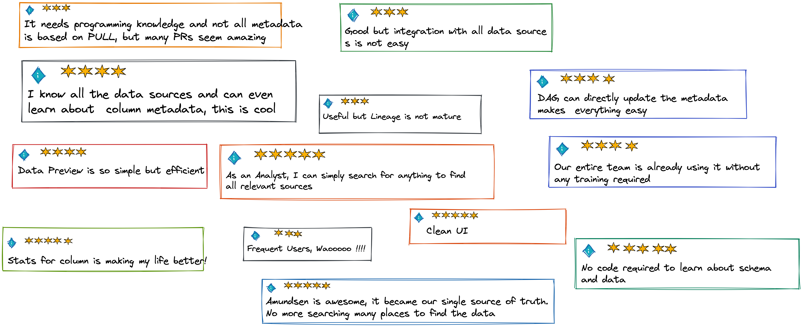

# Amundsen, A data discovery and metadata engine, Non Technical EASY REVIEW

Amundsen is a data discovery and metadata engine for improving the productivity of data analysts, data scientists and engineers when interacting with data

## Basic Setup

Process is Straight forward using Docker https://www.amundsen.io/amundsen/installation/. 
_This is the easiest point to start and understand the setup. You can write your custom Data Uploader to verify_

## Kubernetes Installation 

- Configuration Changes need building Docker Image and then using it inside Kubernetes. This is not easy if you are changing stuff frequently.
- Many New/POC features need config update.

## Amundsen UI

- Main UI is clean and very easy to understand
- Tags are not easily searchable, sometimes nothing comes up
- Search is quick and clean. Shows enough infomartion
- Resource UI has enough kwds to search but can be improved

## Metadata Info

 
 

## Data Preview

## Data Upload

## Future

