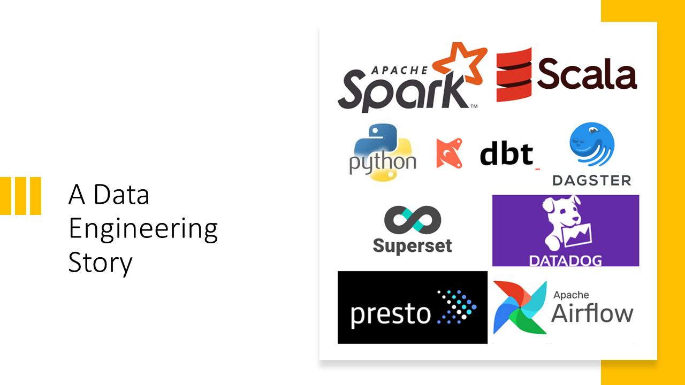
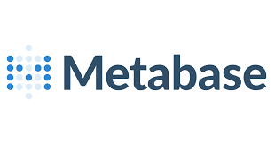

# A Data Engineering Story - The Beginning

Data Engineering is technically Software Engineering where the core focus is around __Data__! 

There are many data engineering stories or workflows :sweat_smile:  
In this blog, I've tried to draft a classic journey of __Data Engineer__ which is really not only about
data engineering _but_ 

:100: Team  
:raising_hand_woman: Data Analysts & Data Scientists  
:ghost: Finding __Right Technologies__  
:heart: Restart !  

## Data is Coming :partying_face:

And the Data arrives. Well we have no idea, what is that data all about but the rumour is, around ~ __20 GB__.  
Well its gonna be structured _(or not)_, so it gonna be really easy to estimate, isn't it :relieved:  
:smiling_imp: __#data_is_a_myth__

We all connected [Virtual], and all of us were pretty much convinced on easy sql engine, maybe postgres and then we can simply run 
some basic query for data analysis.  

_Yeah we already decided!_  
Finally the data was accessible & we decided to look into the data, it was __CSV__, yeah 20 GB of CSV ( gzipped) :hot_face: !

### Time for Debate
Nothing is easy !  
A huge file of __csv__ :file_folder:, unzipped and we have now many things to consider
	
	* Is it really gonna be the only file ?
	* Is the data actually clean ??
	* Is postgres really a smart choice ?
	* As we already know about bigdata & data engineering, why not building it already ?
	* Are we really gonna need all the 300+ columns in the data
	* ...

So the best choice was to really focus on data exploration!

## Data Exploration

Data Exploration is really not about loading the data, but first we need to know the __Data!__  
To know more about data, we have the default choice - :loudspeaker: __Apache Spark__  
_No, there was not much of a debate at this moment_

	
	1. Store the data on any distributed file system, lets consider here S3.
	2. Load data in Apache Spark
	3. Run analysis, peace of cake

__NO__, how can it be so easy ?  

:name_badge: Well its a single file, larger than 20 GB & Spark Driver is showing Attitude.  
:name_badge: Spark write is behaving way more crazier, JVM Heap!  
:name_badge: Ask for any group query, shuffling is hitting JVM hard  

__#:broken_heart:jvm__

### Data Partition Plan

We need a way to make this process __scalable__!  
We decided to split the data into multiple partitions of some reasonable size. Considering Spark, we fixed the range between __150 ~ 250 MB__.
 
Do we really wanna continue using CSV ?   
No, we need a more optimized columnar data format, so __Parquet__ was an obvious choice for us.

	1. Load the data in Spark
	2. Write the data back to S3 within partition range as Parquet Data Format.

### Data Exploration Visualization

We heard data is ready, can we explore the data! Suddenly Data Analysts & Data Scientists jumped into the discussion.  
Well get ready!!! :running_man::rotating_light::boom:

So convincing  Data Analysts & Data Scientists to explore the data over _commandline! is <> _  
Well we can provide __Jupyter Notebook__ but still not the best solution. So, we really need to provide an interface to work...  

Data exploration Platform should atleast have the following -

	1. Open Sourced
	2. Support Large Scale Data Exploration
	3. Fancy Graphs
	4. Dashboarding
	5. Sharing
	6. Governance
	7. Multi Data Source Connectivity
	8. Easy to use

So technically, we are expecting everything for a __large scale project__.
Well after many hours of discussions -

 

	 1. PRESTO, an open source distributed SQL query engine 
	 2. METABASE, open source way for everyone in your company to ask questions and learn from data.

_disclaimer: There are still discussions on why not apache superset or some other distributed sql engine & I am sure its never gonna end._

   

But for now we provided an amazing interface which can be used by our Analysts & Scientists to explore the data and discover insights.  
Hurray, we can now make _Data Driven Decisions_. Really, Can we :cold_sweat: ?

## Big Data

Well we were hoping to enjoy the moment but suddenly we got hit :bomb: by data, a lot of data.  
__The problem now shifted from Data to Big Data__

So what, we have a _Spark cluster and parquet based partitioned data_, so we can transform all new data to the similar format :sunglasses:.  
Easy guys, well there are some problems we never addressed when we started -

	1. With so much data, Queries are way too slow
	2. This new data is burning too much resources in Infrastructure
	3. Even its structered data, its has too many Nulls, weird characters and what not & we never did any preprocessing
	4. Too much data to explore

We realized we never optimized the job for faster query, but just to add partitions (random).  
There was not even a discussion on data cleaning as we were not aware what to expect.   
> Data to Big Data was sudden & our pipeline was not designed to support that.

### Data Platform

This is where actual engineering begins. We sat with Data Analysts & Data Scientists to plan 

	1. We are receiving data every data, so we need to run a batch job every day
	2. There are more than 300 + columns in the data, but there are some specific point of interests for now
	3. Create Data Partitions based on identifiers ( Date, Id, POIs) etc.
	4. Data has too many gaps and have many duplicates, add spark transformations for clean data
	5. Data Scientists are interested on more deeper level on the data, so schedule another job 
	on top of first level of processing.
	6. Data Analysts may want to run some crazy query, so what about manually trigger batch jobs.
	7. There are some queries which are too common, why not keeping that inside data pipeline! :imp:
	8. What about feature engineering :worried:

### Scala / Python / Java or what ?

 

Well entire team understands python, but Spark is still not great with Python. What if in future we need to connect to Kafka, well Python... Naaah!
__So why not data pipeline on Scala & Data Science related logic on Python.__
Yeah, its 2 languages, but we can work with it.

### Workflow 

We have now many jobs, running on different point in time and we are now talking about scheduler.
Yeah not a cron job for sure, so we need a platform to programmatically author, schedule and monitor workflows.

  

__Again The Debate__

This should never end, as now open source community is brining too many options and every options has its own factor, but considering other group and previous 
experince, we concluded on __Apache Airflow__. ( #fornow )

## All done, Really!

So now we have airflow to schedule all the jobs. There is a manual trigger via interface. Metabase to explore data and run faster query. And Spark pipeline to clean
and build features. We are done .. yeah :cowboy_hat_face:

No, That is No!
Where is minitoring. Really

    

	1. Job failed after office hours
	2. Everybody hates pagerduty 
	3. What failed and how to debug
	4. There is sudden spike in resource utilization, why ?
	5. Why suddenly this job is slow ?
	6. Nobody has any idea what am I running in cluster, nothing to worry :astonished: ?

## After V1.0

This is really not the end, but the beginning. Technically we just launched the Project and now more people gonna use it and more requirements gonna pop-up.
Next discussions will be around _Data Warehousing, Data Analytics and Large scale Machine Learning Platform_ and what not!

__So we just opened the pandoras box and things gonnna be more exciting, more debate and more technologies :satisfied:__
