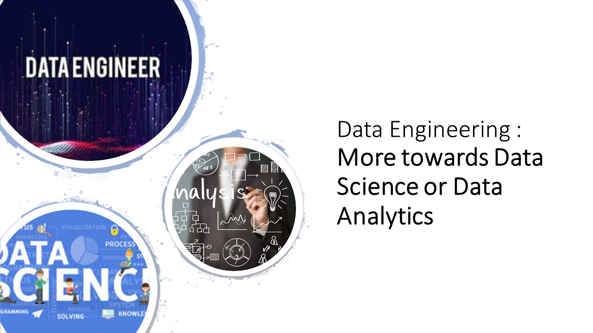
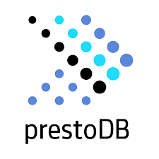

# Data Engineering - More towards Data Science or Data Analytics or ...

Data Engineering is technically Software Engineering where the core focus is around __Data__! 

There are way too many overlaps in Data Engineering & sometimes its unclear, a data engineer works for either data science
or data analytics or really what :fearful:  

:100: Data Science or Applied Machine Learning  
:boom: Data Analysts  
:dash: Large scale Analytics  
:pray: Infrastructure / Devops  
:speech_balloon: Software Engineering  

## A Very Data Science - Unstory :ghost:

Data Scientists were busy building complicated Machine Learning model over __#scikit-learn__ and there is no better technology to conider at the moment.

We assumed everything is going great, & then data scientists scheduled a meeting :calendar: with data engineers.

### The Meeting

For data scientists, everything were going great. They can tune the machine learning algorithm to work anyway within a 
single machine, so scikit-learn is great. But the problem statement changed. Suddenly one of the groups, got a problem
regarding CNN ( Need massive data, needs everything ).  

Scikit-learn was out of question now

	1. Need to parallelize scikit-learn
	2. Heard about GPU
	3. There some new technologies around distribited Machine Learning. 
	4. CAN YOU HELP US ?

The last point was killer :gift_heart:. There comes the reason where a Data Engineer will have to jump in.

### Setting up new technologies for Data Science.

Setting up a new playground for experimenting new technologies is hard but necessary :bell:.  
Well just setting up a single technology may be not enough so lets setup multiple technologies. Well you never know 

  

### What about Productioninzing | The Conversation

:woman_student: The ML code is ready, tested its working fine  
:running: Awesome ! Do you want something...  
:woman_student: Of-course, isn't code should be clean, Tests & cicd  
:running: Sure, that is the minimal requirement to run in production   
:woman_student: Awesome, so I will be adding you as a Reviewer. Or __Role Reverse__ :smiling_imp:    
:running: What is this Role Reverse :raising_hand:  
:woman_student: It will be way easier, faster and better if you productionize the code and I review it, that way you will learn what I did
& I will learn __cicd__ and other necessary stuff  
:woman_student: Or, I will write all these and you just review.  

Honestly, to know more about actual code, a Data Engineer should try to productionize Data Scientist's code, 

	1. A Data Engineer can understand it way better
	2. Helps debugging and add engineering perspective
	3. Complement the code with Infrastructure
	4. Bus Factor

	
> Its not a discussion about a Data Scientist should not learn engineering, Infrastructure etc but if more about helping each other, finally its a Team Effort ! Its absolutely fine to not Role Reverse !

## The Data Analysts - Missing You :chart_with_upwards_trend:

Our SQL Ninjas were writing long complicated SQL queries & revealing insights around the data untill

	1. There is way too much data and sql is running too slow
	2. Parquet/avro format data, now how to run query on them
	3. Learning Python is fun but...
	4. There are way too many data sources, can there be a single interface
	5. Dashboarding is fun but need more flexibility
	6. Just taking the data and running sql is getting too much complicated, can we preprcess

### Data Analytics Platform

With many data sources and ever increasing data size, simple postgres/sql engine was not enough to handle  
So as a Data Engineer we have to decide  

  

:pushpin: A SQL interface with intuitive UI, supporting many different data sources like parquet, databases, csv, flatfiles etc  
:closed_book: Licenses are expensive, __Open Source__ please  
:watch: Can't wait too long for this setup  
:loop: Till __Python__ happens, a library interface to transform data  

> Data Analyst with Python knowledge is an asset but Data Engineer can still contribute & make it better

## DevOps - They take care everything :cowboy_hat_face:

DevOps is almost always busy taking care many requests and then __Data Science Engineering__ teams add few more

	1. Airflow is cool and working/supporting by infrastructure but wanna explore Prefect, heard its Cooler
	2. A Temporary job needs a new Cluster setup
	3. Want to run an experiement for longer term but only for a single Team
	4. My data pipeline job failed, #JVM error .. My Code is fine!
	5. Machine Learning needs distributed setup, can ...
	6. Transfer data from one bucket to another, a Lambda please

 

There are many specific requests come from a Team which usually got ignored that DevOps/Infrastructure can't simply support all requests and specifically individual experiment request.  
A __Data Engineer__ can really fill the gap :sunglasses:

## Conclusion :space_invader:
A Data Engineer can really provide inputs for many roles as its inhertence is from Software Engineering. But every company has a bit different definition of Data Engineering and sometimes its very Team Specific.

:station: __Data Engineer Platform__ Building and managing Large Scale Distributed System & provide ETL as a Service  
:chart: __Data Engineer Analytics/BI__ Building large scale Analytics platform ( a bit of overlap :point_up_2:)  
:woman: __Applied Machine Learning__ Data Engineer working closely with Data Scientists and partially applying Machine Learning Models    
:construction_worker: __Data Integration Engineer__ Managing data interfaces from many heterogenous systems  
:exclamation: __Software Engineer, Data__  
:cloud: __Cloud Data Warehouse Engineer__ Reporting, ETL/ELT ( overlap)  
:video_game: __Data Infrastructure Engineer__ Administrating and Scaling large scale cluster over global or complete enterprise level  

_Ok Now this blog already got bit long, so I will stop here and continue later ..._